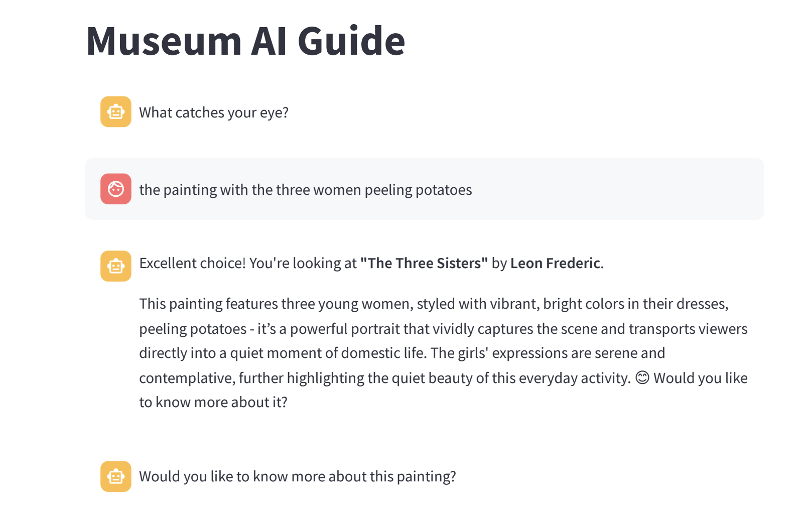

# COMS 6998 - Museum-AI Project

This repository contains scripts to run the Museum-AI project for COMS 6998 Practical Deep Learning. Below are the instructions to install and run the project.

- Tiffany Sentosa: ts3164
- Azam Khan: ak4973

## Installation

### Gemini

1. Clone the repository:
    ```bash
    git clone https://github.com/tiffanysentosa/museum-ai.git
    cd museum-ai
    ```

2. Create a virtual environment and activate it:
    ```bash
    python3 -m venv venv
    source venv/bin/activate  # On Windows use `venv\Scripts\activate`
    ```

3. Install the required dependencies:
    ```bash
    pip install -r requirements.txt
    ```

4. Create a `.env` file in the root directory of the project and add the following environment variables:
    ```bash
    HUGGINGFACE_API_KEY=<your_huggingface_api_key>
    GEMINI_API_KEY=<your_gemini_api_key>
    FAISS_INDEX_PATH=<path_to_faiss_index>
    ```

### Gemma2 or Qwen2.5 through Ollama

5. Clone the repository and checkout the qwen-testing-branch or the gemma-testing-branch:
    ```bash
    git clone https://github.com/tiffanysentosa/museum-ai.git
    cd museum-ai
    git checkout qwen_testing_branch  # or gemma_testing_branch
    ```

6. Follow steps 1-4 above.

7. Install ollama on machine

```bash
curl -fsSL https://ollama.com/install.sh | sh
```

8. Pull the models from Ollama
    
    ```bash
    ollama pull qwen2.5:0.5b
    ollama pull gemma2:0.5b
    ```

9. Serve models
    
```bash
    ollama serve      
```


## Running the Project

You will need to install Huggingface Hub and login with API key to use the tokenizer in the project. You can do this by running the following commands:
```bash
pip install huggingface-hub
huggingface-cli login
```

### Command Line Interface

To run the project using the command line interface, execute the following command:
```bash
python museum_ai_main.py
```

### Streamlit User Interface (Optional)

If you prefer to run the project using a graphical user interface, you can use Streamlit. Execute the following command:
```bash
streamlit run main_streamlit.py
```

This will start a local web server and open the application in your default web browser.

#### Usage Examples of Streamlit UI

1. **Chatbot Conversation**: Enter a prompt in the text box and click the "Submit" button/hit enter to invoke the LLM and get a response.



- Full video demo of the Streamlit UI can be found [here](https://drive.google.com/file/d/1W-aTvRvSIub9t63kFWiz73_8vu4i0M1-/view?usp=sharing)